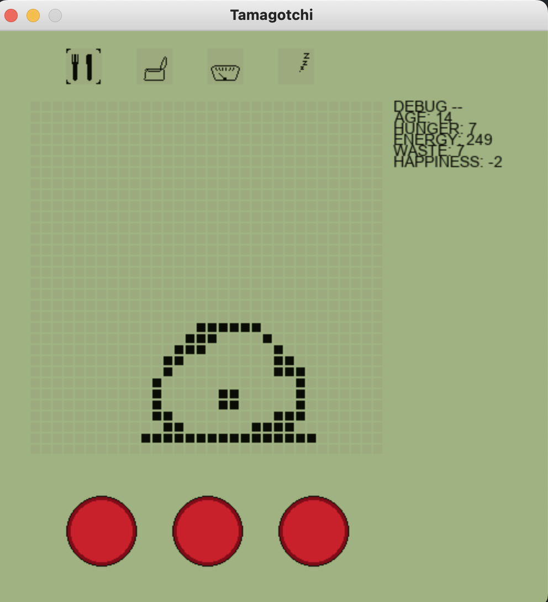
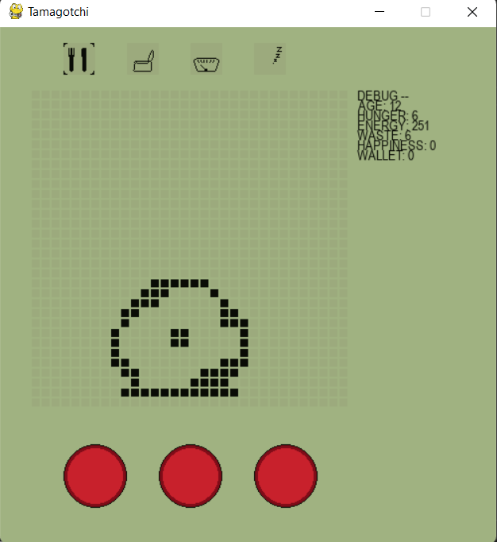

# **Final Project Report**
## **Names: Nikhil Dange & Ryan Irwandy**

# Lab Overview:
This lab was the final challenge presented in ECE 16 for Spring 2022. Throughout this lab, we put together everything we had learned all quarter, and moved away from building purely a smart-watch, by applying these concepts to other applications.

## **Grand Challenge 1**
This challenge was focused on integrating several improvements and features to an existing SpaceInvaders rendition built on PyGame. The idea was for our wearable hardware to double as a video game controller, rather than relying on the keyboard of a computer. Out of the box, this worked, albeit poorly. Tilitng could move the ship sprite around, but firing, firing while moving, and movement overall were things that were slow, coupled together, and inefficient to use. 

### **Design Decisions** ###

We iterated upon both improvements and features for this challenge. For the improvements, the biggest motivating design factor was the poor gameplay with the controller. Firing while moving (which seemed like an important part of the game) was tethered together, so only one command at a time would be able to execute either of these actions. We decoupled these by using a button to induce firing - this way, the socket communication was open just for the orientation and movement of the controller. The second improvement we made was smoother movement. The movement was a bit jerky and lagged at times, but was also subject to not moving as fast as normal video games might - for example, tilting a controller 90° to the right should induce faster turning than a 45° tilt. This is what we implemented - we made use of our accelerometer and the axis values that came from this. We first used the serial plotter on Arduino IDE to measure various values returned from each of the axes to establish thresholds for when to speed up movement. Once we collected this data, we implemented this by checking these values in-game and executing the appropriate movement speed. Finally, our third improvement was centered around a similar idea, but in respect to firing speed. In a game, one might want to fire faster in a certain situation to destroy more enemies, so we decided to implement this, by combining the down tilt and the button press to fire at a faster rate. This essentially sacrifices movement for a faster firing rate incorporating more strategy to the gameplay.

We also implemented features in this game to enhance user experience. Given that we had a wireless controller, we thought it might be wise to utilize the OLED display for ease of gameplay. We decided to display a live score counter so that players might be able to quickly reference the controller, or for spectators to keep up with the game. This was accomplished through the use of socket communication - we sent information back from the game to the controller, and from the controller to Arduino IDE to be displayed on the OLED. We also thought it might be useful to display the top 3 scores of this game, much like a classic arcade game. This was accomplished through file I/O - we essentially wrote top scores to a CSV file, and continually checked the values after every game to see if the current score beat any of the top 3. It works essentially by appending the score after every game, sorting the list, and then returning the top 3 values to the oled. This was then opened on the controller side, and also sent to Arduino IDE for display on the OLED. This mimicked an actual arcade game, since saving to a local file meant that scores would not get erased if one closed their laptop. Our final improvement was designed to give players more interaction during the game in the form of tactile feedback. We integrated a buzzer motor to buzz whenever the player's ship was hit by an enemy - this was again achieved through socket communication, as we sent a command to the controller from the game whenever the ship's state was hit. This was then sent to Arduino IDE, and the buzzer vibrated whenever the command was recieved.

[Here is a video for our final game implementation!](https://www.youtube.com/watch?v=KIVJ6xjR8r0&feature=youtu.be)

### **Controller Instructions** ###
To use the controller, simply upload Arduino code to it, then run the PyGame, and finally the Python controller code (ensure the port is correct). Tilting the controller to the right or left will move the ship in that direction, with more extreme tilting inducing faster movement. To fire, press the button. To fire quicker, tilt the controller forwards while pressing the button. 

Here is an image of our controller - it should be held in the orientation below (OLED should be on the right hand side, and the SparkFun Thing Plus should be on the left hand side.)

## **Grand Challenge 2**

As the final challenge of ECE 16, this was the most open-ended challenge yet. With so many options on what to implement, we took an approach relevant to a healthy society today - the idea of building good exercise habits. We decided it would be more motivating to weave this in with a nostalgic game - Tamagotchi.

### **Design Decisions** ###
The primary goal of this challenge was to gamify exercise, to make it a more accessible, fun, and motivating activity. The principle use case would be for individuals who wanted to pair exercise with a game - a similar concept to the popular game Pokemon Go. We believe that this is an appropriate solution to a problem worth exploring - exercise is something that is necessary for every individual to have a healthy and balanced lifestyle. As college students, exercise is often something that might not be prioritized given hectic schedules and the importance of schoolwork. This makes an ideal target for intended users, although gamifying exericse as a whole is meant to make it more inclusive and fun for all - thus, the target users are anyone who struggles with motivation for exercise. By introducing a character that one can care for based on the quality of their exercise, we can ensure that people are motivated to exericse, while having fun and gaining a companion on their exercise journey. And as fans of Tamagotchi, we wanted to bring it to a more modern interface and apply it to the concepts we learned this quarter!

The basis of this game was built from an existing PyGame emulator for Tamagotchi, [built by Rye Salvador](https://www.pygame.org/project/3138). We wanted to integrate this with the wearable that we made throughout the quarter, with a few tweaks to pair this with the theme of gamifying exercise. The most notable change we made was having data collected from the wearable represented in the game. The goal was to get the Tamagotchi character to respond positively or poorly based on the exercise metrics we collected. We found that socket communication was a little problematic - there were issues with lag, which we hypothesized to an abundance of information being sent. To combat this, we decided to use file I/O to read data locally. The wearable would collect exercise data and write it to a file, and our PyGame files would read this data and use it appropriately.

The two main metrics we sent were steps & heart rate. To make this more like the classic Tamagotchi game, we introduced the idea of an in-game wallet. By having a certain amount of completed steps, or a certain heart rate, a user can gain virtual currency to spend on various actions, such as feeding their Tamagotchi, expunging waste, or letting it sleep. This was designed with the help of global variables to maintain values throughout execution of the program. More specifically, whenever 3 more steps were taken, it would send a currency of 3 coins. If the user's heartrate is between 50 and 100bpm, it will send a currency of 1 to the Tamagotchi's wallet. Our design also forced completion one task before the other in order to promote different activities, and to prevent exploitation of the device, such as hooking up motor and gaining infinite currency.

Finally, we integrated various sound effects to further show that the primary objective is to make exercise a fun and engaging thing to do with a virtual Tamagotchi - these effects play at various points based on currency usage, exercise metrics, or the state of the Tamagotchi.

Below is a comparison of the Tamagotchi interface before changes, and after. In the after, there is a new Wallet option, which allows users to see how much in-game currency they have. Below is a before and after of our interface, with the new wallet functionality added.

[Here is a video for our Design Challenge Implementation!](https://www.youtube.com/watch?v=jV3MpRAeasQ)

We generally took a pair-programming approach to working on this project by discussing design, implementation details, and testing together. This was done so that we could both be on the same page as each other, and make sure we were not making any mistakes that we could have to search for after failing a certain test. However, Ryan did spend extra time working on features for this project!

